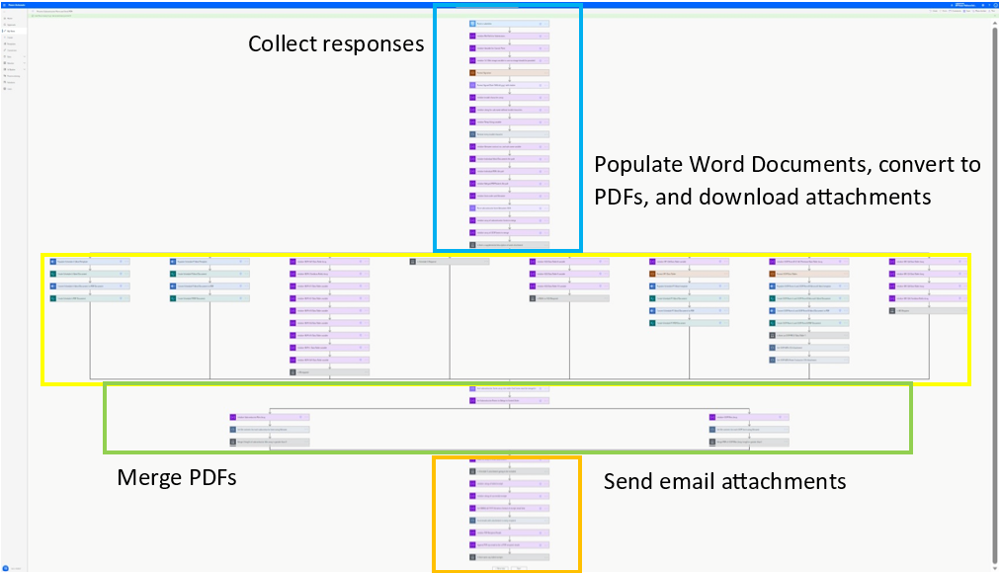

# Process Subcontractor Form and Send PDFs
{: .no_toc}

## Table of Contents
{:toc}

## Purpose 

This flow is an automated process that runs after a submission to the Subcontractor Form is received. It processes the data provided in the submission, generates individual Word Documents and PDFs, creates PDF packets, and sends the packets in individual emails to the subcontractor and TCE representative as indicated in the Initialization Form and Subcontractor Form.

[Back to top](#top)

## Overview

The Process Subcontractor Form and Send PDFs Power Automate flow is automatically triggered to run when the Subcontractor Form is submitted. After being triggered, it does the following:
1. Read data from the submitted Subcontractor Form
2. Process and format the data from the submission for population of Word Templates for each required form
3. Create Word Documents for each required form and convert them to PDFs
4. Download any attachments as PDFs.
5. Merge PDFs into packets.
6. Send confirmation email to subcontractor and TCE recipients as specified in the Initialization and Subcontractor Form.

The above steps are described further in detail in their respective sections. 

The image below shows a high-level overview of the flow.

[Back to top](#top)

## Connections, Triggers, and Actions Used 

Only one trigger is used: [Plumsail Forms](https://learn.microsoft.com/en-us/connectors/plumsailforms/) - Form is submitted

Several connectors and actions are used in the creation of this flow:
* [Plumsail Forms](https://learn.microsoft.com/en-us/connectors/plumsailforms/)
    * Form is submitted
    * Download attachment
* [Variable](https://learn.microsoft.com/en-us/power-automate/desktop-flows/actions-reference/variables)
    * Append to array variable
    * Initialize variable
    * Set variable
* [Control](https://learn.microsoft.com/en-us/power-automate/desktop-flows/actions-reference)
    * [Apply to each](https://learn.microsoft.com/en-us/power-automate/apply-to-each) 
    * [Condition](https://learn.microsoft.com/en-us/power-automate/use-expressions-in-conditions)
    * [Do until](https://www.acuitytraining.co.uk/news-tips/power-automate-do-until/#:~:text=Do%20Until%20in%20Power%20Automate%20executes%20an%20action%20or%20series,time%20the%20loop%20is%20executed.)
    * [Scope](https://www.bloomsoftwareco.com/blog/keep-your-flows-organized-using-scopes-in-power-automate)
* [Data Operation](https://learn.microsoft.com/en-us/power-automate/data-operations)
    * Compose
    * Parse JSON
    * Select
* [Word Online (Business)](https://learn.microsoft.com/en-us/connectors/wordonlinebusiness/)* 
    * Convert Word Document to PDF
    * Populate a Microsoft Word template
* [SharePoint](https://learn.microsoft.com/en-us/connectors/sharepointonline/)
    * Create file
    * Get file content by path
* [Adobe PDF Services](https://learn.microsoft.com/en-us/connectors/adobepdftools/)*
    * Merge PDFs**
* [Office 365 Outlook](https://learn.microsoft.com/en-us/connectors/office365/)
    * Send an email (V2)

*Premium connectors require a Premium Power Automate license which costs $15/user/month as of Aug. 2023
**Every occurrence of Merge PDFs counts as one Document Transaction. There are two Document Transactions occur each time this flow is run - once for each packet that gets merged since the Merge PDFs action is used. See [Pricing and Limitation Considerations](/doc/pricingAndLimitationConsiderations.md) for more information.

## How to Edit

The flow is organized roughly into the four sections seen in the [Overview](#Overview) section.

All files are stored in a SharePoint folder organized by contract number, then subcontractor name, then the time that the form was submitted. The individual files for each MTA-required subcontractor form are named by the order in which they appear in their respective packet, the name of the form, the contract number, subcontractor name, and finally the file extension all separated by a period.

Path format: `.../<contractNumber>/<subcontractorName>/<timestamp>/`
File name format: `<orderInPacket>.<formName>.[<section1>.<section2>.<section3>...].<contractNumber>.<subcontractorName>.<fileExtension>`

Example path: `T-00001/Case2SQS/2023_08_09_10_51_25/`
Example file name: `1.0.OCIP.FAFB.T-00001.Case2SQS.pdf`

See the Edit Power Automate Flow link for information on how to edit the flow itself and Edit Word Template for information on how to edit a word template to be used in the flow.

[Back to top](#top)

----

